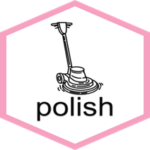

# polish  <a href="https://github.com/GSK-Biostatistics/polish/"></a>

<!-- badges: start -->
[](https://github.com/GSK-Biostatistics/polish/actions/workflows/R-CMD-check.yaml)
<!-- badges: end -->

The goal of polish is to convert R objects into ooxml that is viable for Word documents and PowerPoint presentations.

## Installation

You can install the development version of polish from [GitHub](https://github.com/) with:

``` r
# install.packages("devtools")
devtools::install_github("GSK-Biostatistics/polish")
```

## Example

This is a basic example which shows you how to convert R objects into ooxml:

``` r
library(polish)
## basic example code

## Make word based ooxml
polish_content("{polish} is a great package!", type = "word")

## Make pptx based ooxml
polish_content("{polish} is a great package!", type = "pptx")

```

